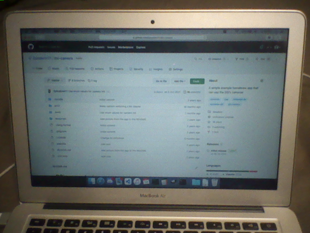
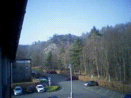
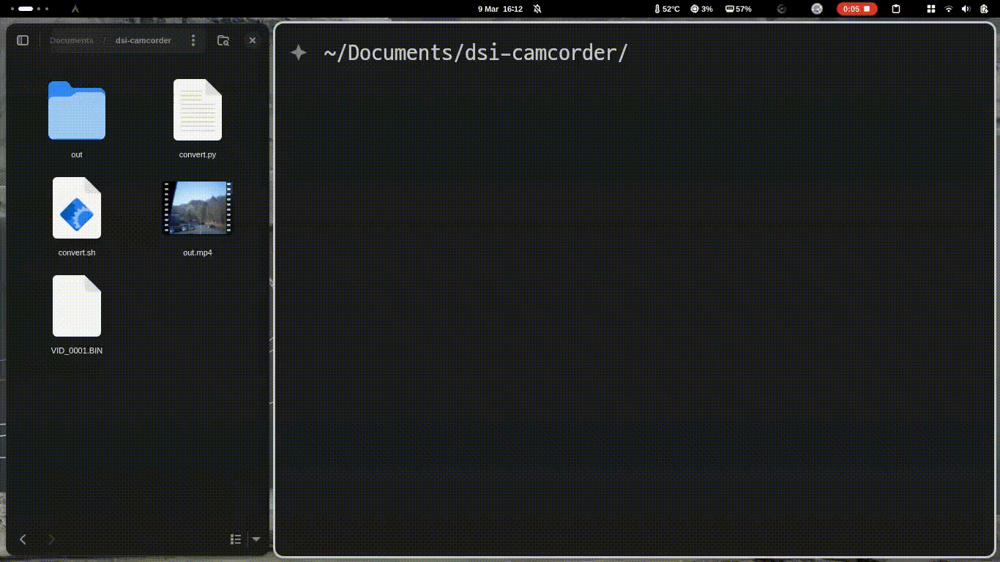

# DSi camera test

This is an example app for using the DSi's cameras. Currently it can show both cameras and save a picture to `sd:/DCIM/100DSI00/IMG_####.png`.

 

You can convert the .bin recording automatically with the convert.sh shell script provided.
Requirements:
```
python3
ffmpeg
```

How to run:
```
./convert.sh path/to/file.bin <framerate_int>
```



Credits to:
- [Arisotura](http://kuribo64.net) for finding why it wasn't working
- [devkitPro](https://github.com/devkitPro) for devkitARM and libnds
- [nocash](https://problemkaputt.de) for GBATek
